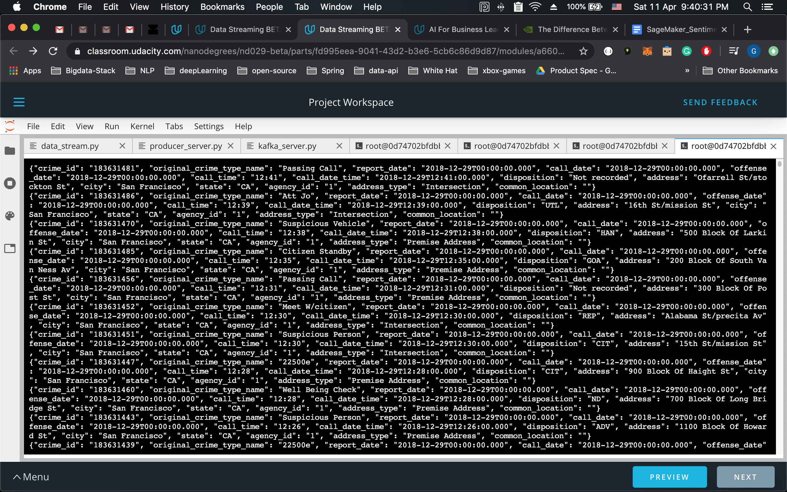
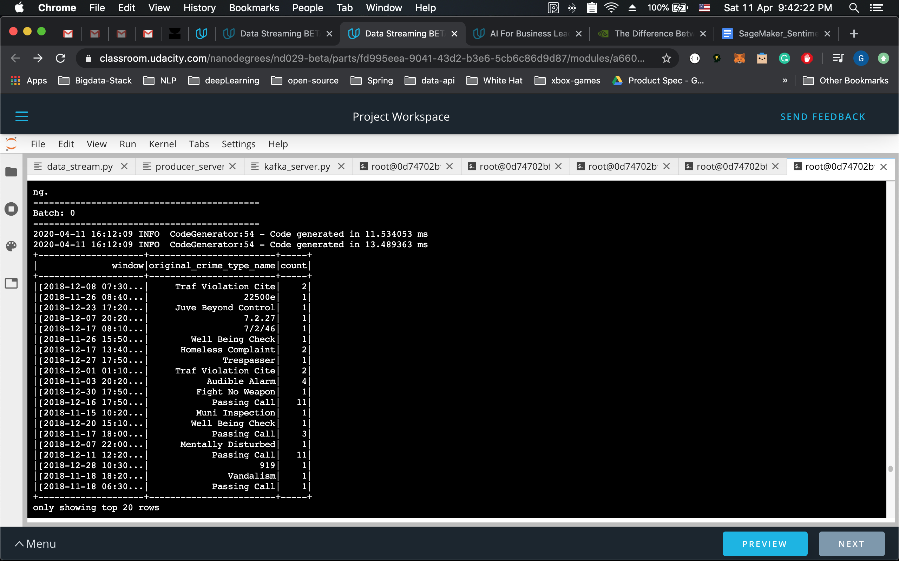
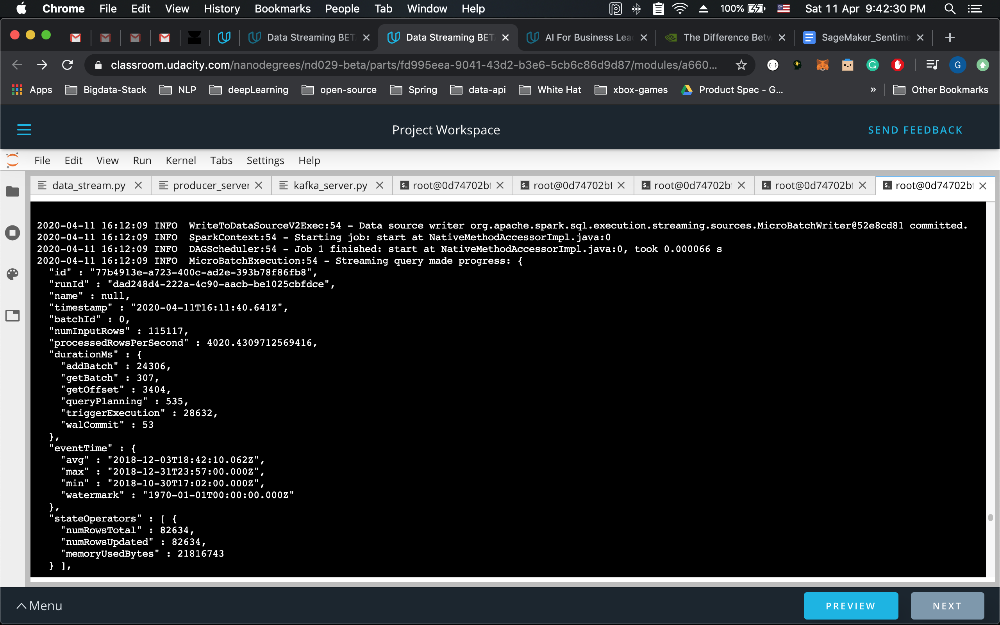
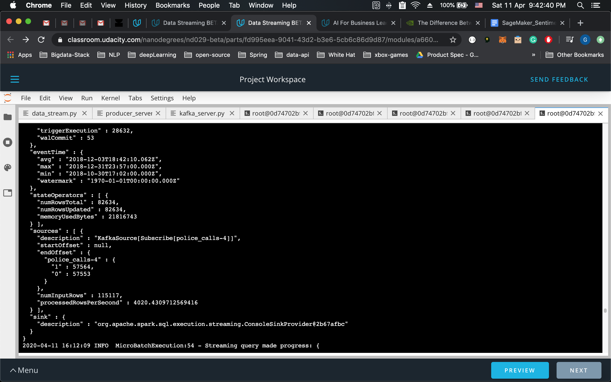

### SF Crime Statistics with Spark Streaming 

**1. How did changing values on the SparkSession property parameters affect the throughput and latency of the data?**

There are few SparkSession property on changing them we can easily see the increase/decrease in throughtput and latency of data.

**2. What were the 2-3 most efficient SparkSession property key/value pairs? Through testing multiple variations on values, how can you tell these were the most optimal?**
Our goal here is to maximize the processing speed of spark job i.e. basically increasing the number of row processed per second. Following is the sparkSession properties that I have tried out and performed very well.  
`spark.streaming.kafka.maxRatePerPartition : 100` 
`spark.default.parallelism : 100` 
`spark.sql.shuffle.partitions : 100`

`spark.streaming.backpressure.enabled : true` - It is not very useful in this scenaria as data size is not very large and job is not very long running. It prevent from being overwhelmed when there is large number of unprocessed message. 

And, incorrectly setting sparkSession property values may lead to dip in performance.
I ran this job with `--master local[*]` using all the cpus

# kafka console consumer result
command `kafka-console-consumer --topic police_calls-4 --from-beginning --bootstrap-server localhost:909`

# PySpark results
command; `spark-submit --packages org.apache.spark:spark-sql-kafka-0-10_2.11:2.3.4 --master local[*] data_stream.py`

Query Progress bar 1             |  Query Progress bar 2
:-------------------------:|:-------------------------:
  |  
